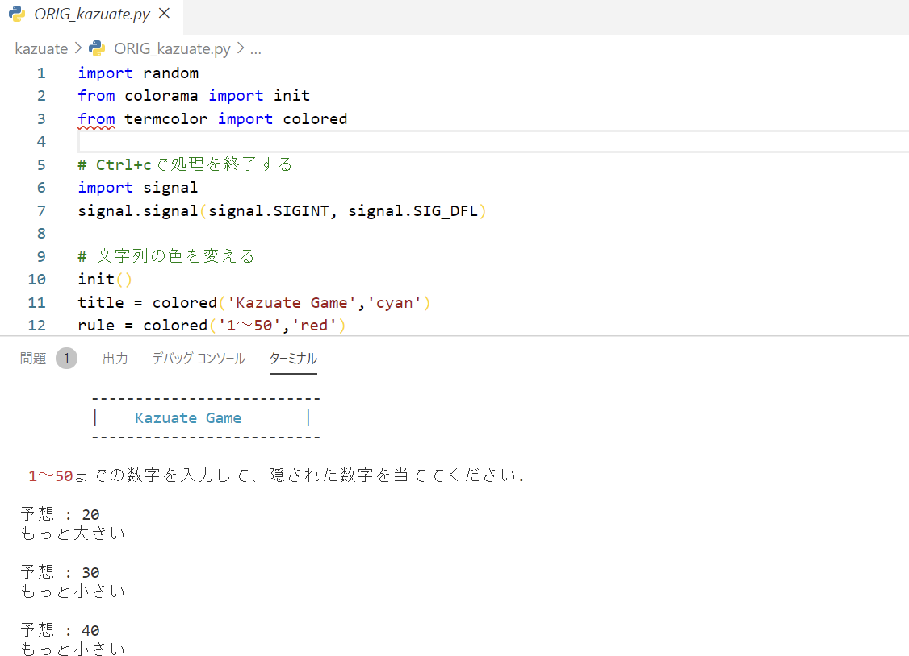

<!-- # サンプル資料 表紙 -->
<div class="cover-container">
    <div class="cover-innner">
        <div class="title-wrapper">
            <h1 class="cover-title">情報システム科 〜Python基礎〜</h1>
        </div>
        <div class="company-name-wrapper">
            <span>MCL盛岡情報ビジネス＆デザイン専門学校</span>
        </div>
    </div>
</div>
<!-- # サンプル資料 表紙 -->

<div style="page-break-before:always"></div>

<!--
<h1 style="text-align: center;">情報システム科 〜Python基礎〜</h1>

<div style="page-break-before:alwas"></div>
-->

## 1.  Hello World

---

```python
print('Hello,World!!')
```

&nbsp;

## 2.  書いたプログラムを実行してみよう

---

ctrl+Jでターミナルを開く

```python
python 01_hello.py
```

プログラムを実行すると次のように画面に出力されます。

```python
Hello,World!!
```

「1.」で書いたプログラムは標準出力と呼ばれます。
printの後ろのカッコの中に書いた文字を画面に出力します。

&nbsp;

## 3.  入力を受け取ってみよう

---

次にキーボードからの入力を受け取ってみましょう。
キーボードはパソコンの標準入力装置になります。入力装置からデータを受けるにはそれぞれ方法がありますので注意しましょう。

キーボードから入力を受け取るには次のように書きます。

```python
input('入力：')
```

書けたら実行してみましょう。

```python
Hello,World!! ← 「1.」で書いたコード
入力：
```

<div style="page-break-before:always"></div>

しかし、このままでは何も起こりません。
もう少しだけプログラムを書き足しましょう。

```python
name = input('入力：')
print('こんにちは！' + name + 'さん！')
```

実行してみましょう。

```python
入力：山田
こんにちは！山田さん！
```

キーボードから入力された文字データを変数（name）に保存しています。
後は処理を加えて変数を出力（print）するとプログラムに挨拶させることができたりします。
標準入出力はプログラムの基本になります。しっかりと押さえておきましょう。

<div style="page-break-before:always"></div>

## 4.  分岐処理を書いてみよう

---

次は分岐処理をやってみましょう。分岐処理には「if文」を使います。
if文の基本的な書き方は次のとおりです。

```python
if 条件式:
    Trueの処理
else:
    Falseの処理
```

実際に処理を入れてプログラムを書いてみましょう。

```python
num = int(input('数字を入力：'))

if num >= 50:
    print('50以上の数字が入力されました。')
else:
    print('50未満の数字が入力されました。')
```

書けたら実行してみましょう。

```bash
数字を入力：60
50以上の数字が入力されました。
```

```bash
数字を入力：30
50未満の数字が入力されました。
```

いかがでしょうか？
入力された数字が50以上か50未満かで処理が分岐しました。
if文の条件式を工夫することで様々な条件で処理を分岐させることができます。

<div style="page-break-before:always"></div>

## 5.  繰り返し処理をしてみよう

---

次に繰り返し処理を試してみましょう。
繰り返し処理はループ処理などとも呼ばれ、同じ処理を繰り返すために使用します。
Pythonでは「while文」と「for文」の2つの繰り返し処理があります。
ここでは「while文」を試してみます。

```python
while 条件式:
    繰り返したい処理
```

実際にプログラムを書いてみましょう。

```python
i = 1
while i <= 10:
    print(i)
    i += 1
```

書けたら実行してみましょう。

```bash
1
2
3
4
5
6
7
8
9
10
```

想像してた通りに実行されましたでしょうか。
変数iが10になるまで繰り返され、その中で出力（print）と加算（i += 1）が行われています。

<div style="page-break-before:always"></div>

## 6.  数当てゲームを作ってみよう

---

最後に今回学んだことを活かして「数当てゲーム」を作ってみましょう。

```python
import random

print("\t--------------------------")
print("\t| Kazuate Game |")
print("\t--------------------------")

print("1から50までの数字を入力して、隠された数字を当ててください。")

def guess_num(num):
    tries = 0 # 予想回数
    
    while True:
        guess = int(input("予想 : "))
        tries += 1
        
        if guess > num:
            print("もっと小さい")
        
        elif guess < num:
            print("もっと大きい")
        
        else:
            print("ご名答! 隠された数字は%s です。" % num)
            print("挑戦回数は%s 回でした!\n" % tries)
            return
            
if name == "__main__":
    the_number = random.randrange(1,50)
    guess_num(the_number)
```
